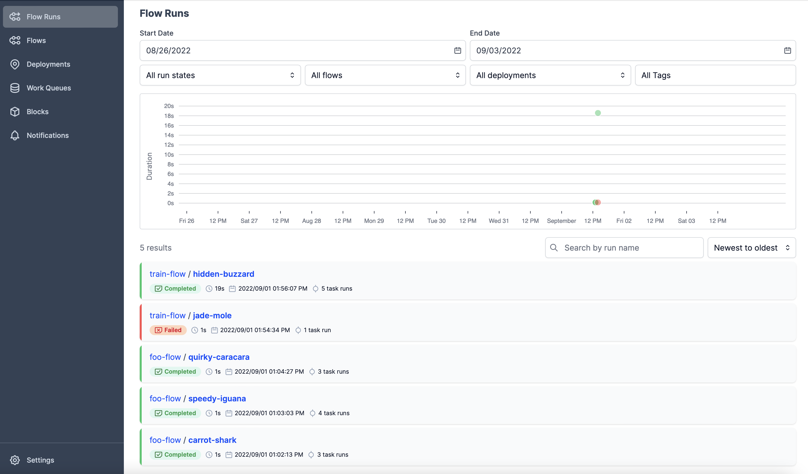
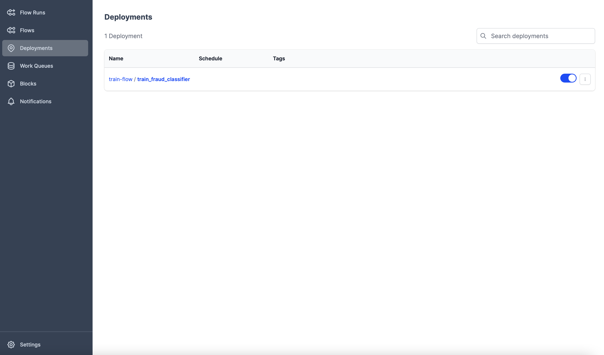
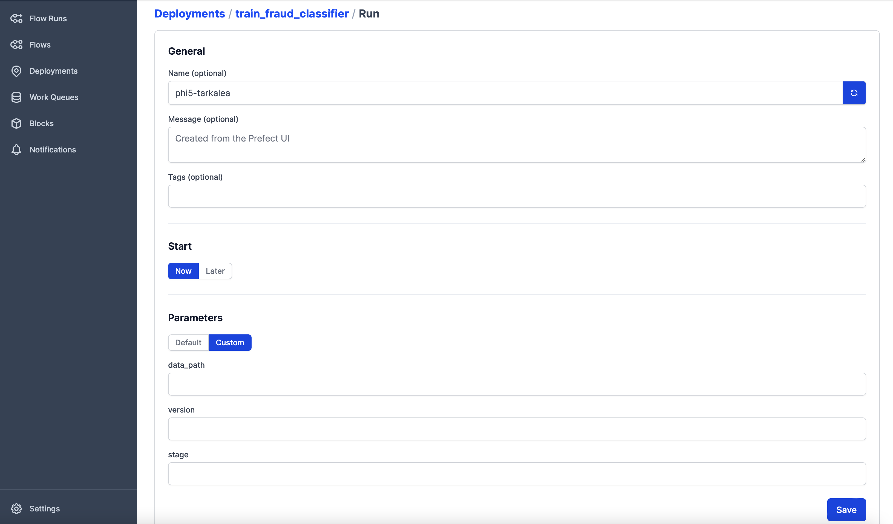

# Data Orchestration Pipelines with Prefect

In this tutorial, we will introduce the idea of data orchestration pipelines and show how you can do continuous model retraining.

Often times, we need to conduct quite complex processes for data extraction, cleaning, and modeling. Furthermore, we often need to run these jobs to run more than once on a regular schedule, potentially in parallel. For this tutorial, we are entering the data engineering world with a simple data orchestration pipeline for training our fraud classifier from previous tutorials.

The core technology of this tutorial is [Prefect](https://docs.prefect.io), a Python framework and tool for conducting such orchestration. Prefect provides useful abstractions running orchestration jobs, a mechanism for running jobs in the cloud and the ability to run sub-processes for jobs concurrently (across multiple machines if you wish). It also provides all the utilities you would need to conduct your jobs robustly, such as logging, retries, caching, and more.

Prerequisites:
- Previous Deployment Tutorials
- Install BentoML
- Install sqlite3

By the end of this tutorial you will be able to:
- Create Prefect Flows
- Run Prefect Flows
- Use Prefect Clous
  
This tutorial assumes you have done the [previous tutorial](https://hippocampus.podia.com/view/courses/build-an-end-to-end-production-grade-fraud-predictor/1462864-deploying-with-bentoml-on-kubernetes) on [BentoML](https://www.bentoml.com). You should have it already if you have done previous tuts, but you can download the data required for this tutorial from [here](https://drive.google.com/file/d/1MidRYkLdAV-i0qytvsflIcKitK4atiAd/view?usp=sharing). This is originally from a [Kaggle dataset](https://www.kaggle.com/competitions/ieee-fraud-detection/data) for Fraud Detection. Place this dataset in a `data` directory in the root of your project.


## Prefect Setup & Concepts
To get started, we will first install Prefect. As per usual, ensure you are in a virtual environment you have set up. You may also need to install `sqlite3`.
```bash
pip install prefect==2.0
```

A Prefect workflow is a Python script that defines a set of processes to be run in a specific order with specific dependencies on each other. There are only two core constructs you really need to know in Prefect: a **flow** and a **task**. You can think of a *flow* as the function that defines the order of execution of the tasks, while a *task* is a function that represents a discrete unit of work to be executed. To demonstrate this, let's create a simple flow example called `example_flow.py`.
```python
from prefect import flow, task


## Tasks
@task
def foo():
    print("foo 1")

@task
def foo_name(name):
    print(f"foo {name}")


## Flow
@flow
def foo_flow(names):
    foo()
    for name in names:
        foo_name.submit(name)


# Call the flow
foo_flow(["2 - electric boogaloo", "3 - gigantic spree"])
```
In this Prefect flow, we have defined two tasks: `foo` and `foo_name`. The `foo` task simply prints "foo" to the console. The `foo_name` task takes a single argument, `name`, and prints a message to the console with the value of "foo `name`". The foo_flow function is the flow that we will run, and orchestrates the execution of the tasks. In this case, we run `foo` first, then submit two instances of `foo_name` to Prefect using our input array. The `.submit` method is a convenience method that allows us to submit tasks for concurrent execution. You can run the flow in your terminal by running `python example_flow.py`.

This is a very simple flow, but it is a good example of how to define a workflow in Prefect. If you'd like more granular control over the execution of tasks, you can convert your flow and tasks to be *async*.
```python
from prefect import flow, task
import asyncio

## Tasks
@task
def foo():
    print("foo 1")

@task
async def foo_name(name):
    print(f"foo 2 - {name}")


## Flow
@flow
async def foo_flow(names):
    await asyncio.gather(*[foo_name(name) for name in names])
    foo()
    await foo_name.submit(names)


# Call the flow
if __name__ == "__main__":
    asyncio.run(foo_flow(["2 - electric boogaloo", "3 - gigantic spree"]))
```


## Creating a training pipeline
Now that we know how to create a flow, let's create a training pipeline based on our model training file from previous tuts. Create a new file called `train_flow.py`. In general, any training flow will consist of loading data from some source (typically from a database), processing, model training and finally saving our model. Our flow will consist of the following tasks in particular:
- Loading Data from our input CSV
- Training a One Hot Encoder for our categorical data
- Splitting the data into training and testing sets
- Training an XGBoost model
- Saving the model to our local Bento model store

First import the necessary libraries.
```python
from prefect import flow, task

import numpy as np
import pandas as pd

from sklearn.preprocessing import OneHotEncoder
from sklearn.model_selection import train_test_split
from xgboost import XGBClassifier

import bentoml
```

Now, we are going to define our tasks. As we have seen, in Prefect these are essentially just Python functions with `@task` decorators.

```python
@task(retries=5)
def load_data(data_path):
    # Load the data, sample such that the target classes are equal size
    df = pd.read_csv(data_path)
    df = pd.concat(
        [df[df.isFraud == 0].sample(n=len(df[df.isFraud == 1])), df[df.isFraud == 1]],
        axis=0,
    )
    return df

@task
def train_ohe(df):
    # Use one-hot encoding to encode the categorical features
    X = df[["ProductCD", "P_emaildomain", "R_emaildomain", "card4", "M1", "M2", "M3"]]
    enc = OneHotEncoder(handle_unknown="ignore")
    enc.fit(X)
    return enc

@task
def split_data(df, enc):
    # Select the features and target, and generate train/test split
    X = df[["ProductCD", "P_emaildomain", "R_emaildomain", "card4", "M1", "M2", "M3"]]
    X = pd.DataFrame(
        enc.transform(X).toarray(), columns=enc.get_feature_names_out().reshape(-1)
    )
    X["TransactionAmt"] = df[["TransactionAmt"]].to_numpy()
    y = df.isFraud

    X_train, X_test, y_train, y_test = train_test_split(
        X, y, test_size=0.2, random_state=42
    )
    return X_train, X_test, y_train, y_test

@task
def train_xgb(X_train, y_train):
    # Train the model
    xgb = XGBClassifier(
        n_estimators=100,
        learning_rate=0.1,
        max_depth=3,
        min_child_weight=1,
        gamma=0,
        subsample=0.8,
        colsample_bytree=0.8,
        objective="binary:logistic",
        nthread=4,
        scale_pos_weight=1,
        seed=27,
    )
    model = xgb.fit(X_train, y_train)
    return model

@task
def save_model(model, enc, version, stage):
    # Save the model with BentoML
    saved_model = bentoml.sklearn.save_model(
        "fraud_classifier",
        model,
        labels={"owner": "Cerebrium", "stage": f"{stage}"},
        metadata={f"version": f"{version}"},
        custom_objects={"ohe_encoder": enc},
        signatures={
            "predict": {
                "batchable": True,
                "batch_dim": 0,
            }
        },
    )
    print(saved_model)
```

Time to define the workflow! This will boil down to essentially calling our functions in the correct order. Add in a __main__ block to be able to call the flow under a `python` CLI command.

```python
@flow
def train_flow(
    data_path, 
    version, 
    stage
):
    df = load_data(data_path)
    enc = train_ohe(df)
    X_train, _, y_train, _ = split_data(df, enc)
    model = train_xgb(X_train, y_train)
    save_model(model, enc, version, stage)

if __name__ == "__main__":
    train_flow(
        data_path="data/train_transaction.csv",
        version="1.0.1",
        stage="prod"
    )
```

You're all set. Now let's run the flow.

```bash
python train_flow.py
```

Congratulations! You've created a training pipeline to train a model with Prefect. 


## Prefect Deployments
Up to this point, you may still be wondering how Prefect adds much value to your workflow beyond logging and retries. After all, we have only basically written a standard training script with extra wrappers. The answer is simple: your workflows  can be orchestrated by Prefect's orchestration engine, Orion. This is the central component, and will allow you to schedule and orchestrate multiple workflows; simultaneously, in parallel and in an automated fashion.

### Local Prefect Environment
To get started, we'll start a local instance of Orion in a separate terminal. You'll be able to check out the Prefect dashboard at [localhost:4200](http://localhost:4200). There are a number of different bits of information you can view here, including the status of your workflows, the logs of your workflows, run details and scheduled runs, among other things.

```bash
prefect orion start
```

You should be greeted with the dashboard similar to this one displaying the status of your recent local runs:


With Orion, you are able to:
- Schedule workflows
- Create Deployments
- Configure agents (more on this later)
- Trigger a workflow

Now that we have Orion running, we can register our flow with Prefect. We will do this with a Prefect *deployment*. A deployment encapsulates a flow, and allows it to be scheduled and run by the API. The kind of metadata included with a deployment is where your flow has been stored and how it should be run.

To create a deployment, run:
```bash
prefect deployment build ./train_flow.py:train_flow -n train_fraud_classifier -q "ml-training"
```
This will create a deployment with the name `train_fraud_classifier` which operates in the work queue `ml-training` which is automatically created. In Prefect, a *work queue* schedules the workflows, while an *agent* is responsible for polling the work queues for new runs to execute.

This should create a deployment file in your current directory, `train_flow-deployment.yaml`, and a file used to omit certain files from the flow, `.prefectignore`.
```yaml
###
### A complete description of a Prefect Deployment for flow 'train-flow'
###
name: train_fraud_classifier
description: null
version: b532662733a67402a4055f1a4d8cd711
# The work queue that will handle this deployment's runs
work_queue_name: ml-training
tags: []
parameters: {}
schedule: null
infra_overrides: {}
infrastructure:
  type: process
  env: {}
  labels: {}
  name: null
  command:
  - python
  - -m
  - prefect.engine
  stream_output: true
  _block_type_slug: process

###
### DO NOT EDIT BELOW THIS LINE
###
flow_name: train-flow
manifest_path: null
storage: null
path: /Users/elijahrou/Cerebrium/Tutorial-Data-Orchestration
entrypoint: train_flow.py:train_flow
parameter_openapi_schema:
  title: Parameters
  type: object
  properties:
    data_path:
      title: data_path
    version:
      title: version
    stage:
      title: stage
  required:
  - data_path
  - version
  - stage
  definitions: null
```

Once we've configured the deployment, we can create it on the API!
```bash
prefect deployment apply train_flow-deployment.yaml
```

We can inspect the deployment with the CLI:
```bash
prefect deployment ls
```
You will also notice that your deployment now shows in the dashboard under the **Deployments** tab.


You may have noticed that Prefect prompted you to start an agent for the `ml-training` work queue when you deployed your flow. Let's do that now in a new tab.
```bash
prefect agent start -q 'ml-training'
```

Finally, let's run our training flow! In the Orion UI navigate to the **Deployments** tab and click on the deployment you just created. On the top right, you'll see a button to run the deployment. Hit it and select **Custom**. Finally, select *Custom* for the parameter values, fill out the following values and press *run*:
- `data_path`: `data/train_transaction.csv`
- `version`: `1.0.1`
- `stage`: `prod`


If you now navigate to the **Flow Runs** tab, you should see a new run for your flow. Click it and observe it running in action!


### Cloud Prefect Environment
As demonstrated, Prefect needs two core active components to run: an agent and the orchestration engine. Running Prefect in the cloud is easy, you simply need to setup both components and deploy your flows to the remote engine.

#### Orion Setup

